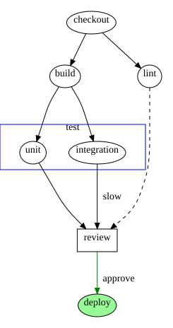

# layout [](https://godoc.org/github.com/loov/layout) [](https://goreportcard.com/report/github.com/loov/layout)

## Experimental

Current version and API is in experimental stage. Property names may change.

## Installation

The graph layouting can be used as a command-line tool and as a library.

To install the command-line tool:
```
go get -u github.com/loov/layout/cmd/glay
```

To install the package:
```
go get -u github.com/loov/layout
```

## Usage

```go
package main

import (
    "log"
    "os"

    "github.com/loov/layout"
    "github.com/loov/layout/format/svg"
)

func main() {
    graph := layout.NewDigraph()
    graph.Edge("checkout", "build")
    graph.Edge("checkout", "lint")
    graph.Edge("build", "unit")
    graph.Edge("build", "integration")
    graph.Edge("lint", "review").LineStyle = layout.Dashed
    graph.Edge("unit", "review")
    graph.Edge("integration", "review").Label = "slow"

    approve := graph.Edge("review", "deploy")
    approve.Label = "approve"
    approve.LineColor = layout.RGB{G: 0x80}
    graph.Node("review").Shape = layout.Box
    graph.Node("deploy").FillColor = layout.RGB{R: 0x98, G: 0xFB, B: 0x98}

    graph.Clusters = []*layout.Cluster{{
        ID: "test", Label: "test",
        Nodes:     []*layout.Node{graph.Node("unit"), graph.Node("integration")},
        LineColor: layout.RGB{B: 0xFF},
    }}

    if err := layout.Hierarchical(graph); err != nil {
        log.Fatal(err)
    }
    svg.Write(os.Stdout, graph)
}
```



The same graph drawn for a terminal, with `text.Prepare(graph)` before laying out and `text.Write` instead of `svg.Write`:

```
                      ╭────────╮
                      │checkout│
                      ╰──┬──┬──╯
                         │  │
                   ╭─────╯  ╰───────────╮
                   │                    │
                   ▼                    ▼
                ╭─────╮               ╭────╮
                │build│               │lint│
                ╰─┬─┬─╯               ╰─┬──╯
                  │ │                   ┊
           ╭──────╯ ╰──────╮            ┊
           │               │            ┊
┌ test ┈┈┈┈╂┈┈┈┈┈┈┈┈┈┈┈┈┈┈┈╂┈┈┈┈┈┈┈┈┈┈┐ ┊
┊          │               │          ┊ ┊
┊          ▼               ▼          ┊ ┊
┊       ╭────╮       ╭───────────╮    ┊ ┊
┊       │unit│       │integration│    ┊ ┊
┊       ╰──┬─╯       ╰─────┬─────╯    ┊ ┊
┊          │               │          ┊ ┊
└┈┈┈┈┈┈┈┈┈┈╂┈┈┈┈┈┈┈┈┈┈┈┈┈┈┈╂┈┈┈┈┈┈┈┈┈┈┘ ┊
           │               │            ┊
           │               │ slow       ┊
           │               │            ┊
           ╰─────────────╮ │ ┌┈┈┈┈┈┈┈┈┈┈┘
                         │ │ ┊
                         ▼ ▼ ▼
                       ┌──────┐
                       │review│
                       └───┬──┘
                           │
                           │ approve
                           │
                           ▼
                       ╭──────╮
                       │deploy│
                       ╰──────╯
```

Other layouts and outputs:

* `layout.Force(graph)` — force-directed layout for undirected or cyclic graphs.
* `layout.HierarchicalWith(graph, layout.Fast)` or `layout.Quality` — trade crossings for time.
* `layout.Options{Align: layout.AlignLeft}` or `AlignRight` — pack the layout to one side, with nodes over their first or last neighbor, instead of centering them.
* `format/json` — plain coordinates for drawing the graph elsewhere.
* `format/text` — Unicode box-drawing output for terminals; call `text.Prepare(graph)` before laying out. `text.WriteColor` adds colors in the terminal theme's basic colors, or exact 24-bit colors, optionally on a background.

The same is available from the command line: `glay -l force -q fast -t txt|ans|json|svg|dot input.dot`; colored text takes `-colors 16|truecolor` and `-bg color`.

## Quality

Currently the `layout.Hierarchy` algorithm output is significantly worse than graphviz. It is recommended to use `graphviz dot`, if possible.