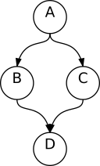

# layout [](https://godoc.org/github.com/loov/layout) [](https://goreportcard.com/report/github.com/loov/layout)

## Experimental

Current version and API is in experimental stage. Property names may change.

## Installation

The graph layouting can be used as a command-line tool and as a library.

To install the command-line tool:
```
go get -u github.com/loov/layout/cmd/glay
```

To install the package:
```
go get -u github.com/loov/layout
```

## Usage

Minimal usage:

```
package main

import (
    "os"

    "github.com/loov/layout"
    "github.com/loov/layout/format/svg"
)

func main() {
    graph := layout.NewDigraph()
    graph.Edge("A", "B")
    graph.Edge("A", "C")
    graph.Edge("B", "D")
    graph.Edge("C", "D")

    layout.Hierarchical(graph)

    svg.Write(os.Stdout, graph)
}
```



See other examples in `example` folder.

## Quality

Currently the `layout.Hierarchy` algorithm output is significantly worse than graphviz. It is recommended to use `graphviz dot`, if possible.